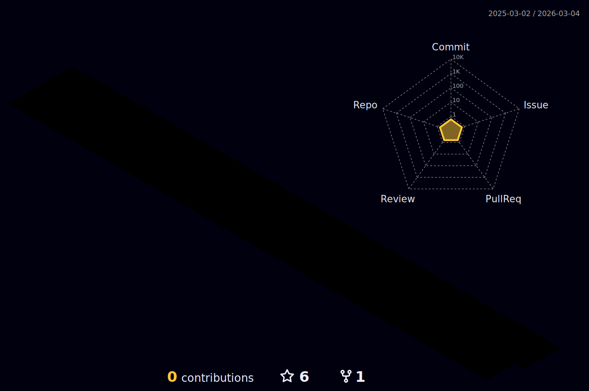

## Hi there 👋

### My name is Emirhan Karakadıoğlu but you can call me Bolzac.
I am a student at Yildiz Technical University, Mathematical Enginnering departmant.
I met with coding at 2020. I started with web development and for now I am full stack web developer.

🔭 I’m interested in web development, embedded systems, game development and pixel art.

## 
 :computer: Technologies 

  
  
  
  
  
  
     
     
  
  
  
     
     
  
  
  
  

 
 

